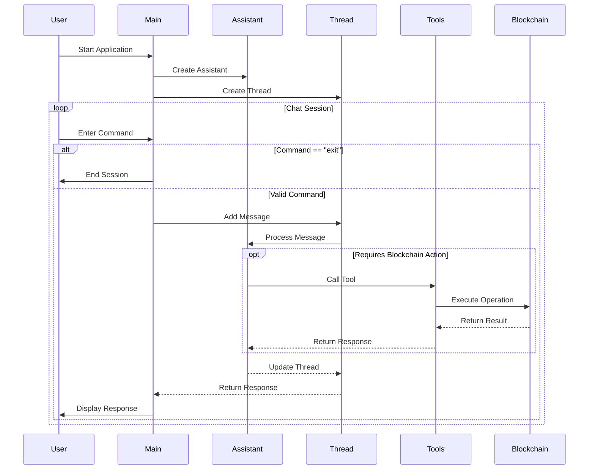

# SonicAI

## Description

**SonicAI** is a powerful tool designed to interact with [Sonic SVM network](https://www.sonic.game/) following the principles of the [PostWeb by Outlier Ventures](http://postweb.io/). It leverages OpenAI's GPT-4o-mini model to provide a conversational interface for users to perform various blockchain operations, such as checking wallet balances, sending transactions, and more. 

## What is the problem?
Blockchain networks have brought many new opportunities to millions (if not billions) of people, but the problem lies in the interaction, since Web3 has not managed to popularize such opportunities because it is complex to use for non-technical users (managing wallets, signing transactions, many approvals before spending, among others).

AI appears as an opportunity not only to reach non-technical users, but also to reduce the time and steps for each interaction, that is, to do a lot with few instructions.

## SonicAI was born to solve this problem
There are already many frameworks designed to connect AI agents to Blockchain, but SonicAI goes one step further, with the following features:
- Lightweight, with few dependencies needed.
- Focused on the Sonic SVM ecosystem (already integrated with some protocols (Pyth for prices) and extensible in a few steps).
- Ability to execute several on-chain actions with a single instruction (for example: "if you have more than 1 SOL, send 0.1 to xxx and get the price for Sonic token").

## Mode
For now, SonicAI works in a CLI mode, in the future, it will be available to integrate in other platforms, such as messaging.


## Features

- **Conversational Interface**: Engage with the assistant to perform blockchain operations through natural language.
- **Wallet Operations**: Check wallet balances, last transactions, retrieve connected wallet addresses, and more.
- **Transaction Management**: Send transactions (in SOL).
- **Price Management**: Ask for prices using [Pyth feeds](https://www.pyth.network/).
- **Error Handling**: Robust error handling and feedback for failed operations.

## Getting Started

### Prerequisites

- Node.js (version 14 or higher)
- TypeScript
- [OpenAI API key](https://platform.openai.com/) to enable the AI agent.
- SVM Mnemonic wallet.

### Installation

1. Clone the repository:

   ```bash
   git clone https://github.com/web3-explorers/sonicai.git
   cd sonicai
   ```

2. Install dependencies:

   ```bash
   bun install
   ```

3. Set up environment variables:
   Create a `.env` file in the root directory and add your OpenAI API key, wallet key file and other information for the network:
   ```plaintext
      OPENAI_API_KEY=************ enter your key here
      SVM_MNEMONIC=**************** enter your SVM/Sonic mnemonic here
      ASSISTANT_NAME=******************* a name for your AI assistant
      SVM_ENDPOINT=************ the Sonic SVM endpoint
   ```

### Usage

To start the assistant, run:

```bash
bun run src/index.ts
```

You can then interact with the assistant in the command line. Type "exit" to end the conversation.

### Tools

The assistant has access to various tools for performing blockchain operations:

#### Read Operations
- **get_balance**: Check wallet balance (in SOL)
- **get_wallet_address**: Retrieve the connected wallet's address
- **get_solsupply**: Get total and circulating SOL supply in the network.
- **get_price_sonicsvm**: Get the price for Sonic using [Pyth feeds](https://www.pyth.network/)


#### Write Operations
- **send_transaction**: Send transactions with customizable parameters including:
  - Transaction value in SOL
  - Address.

#### How to extend

1. Create the actions in the [src](./src/) folder
2. Create a new tool file in the [tools](./tools/) folder.
3. Add the function in the tool with unique name.
4. Register the tool in [allTools](./tools/allTools.ts)
5. Update the prompt (**in the prompt file inside the constants folder**) for the assistant to understand when it must run the tool.


## Codebase Flow

The following sequence diagram illustrates the core flow of the application:



### Diagram Explanation

The sequence diagram above shows the interaction flow between different components:

1. **Initialization**:
   - SonicAI starts with creating an OpenAI Assistant
   - A new Thread is created for the conversation

2. **Chat Session Loop**:
   - User enters commands through the CLI
   - Commands are processed through the Thread and Assistant
   - For blockchain operations in Sonic, specific Tools are called
   - Results are returned through the chain of components

3. **Blockchain Integration**:
   - Tools interface with the blockchain through typescript sdks client
   - Operations are executed on the Sonic network
   - Results are propagated back to the user

4. **Session Management**:
   - Users can exit the application at any time
   - Each command is processed in a sequential manner
   - Responses are displayed back to the user


## Team

**Company**: [Techgethr](https://www.techgethr.com/), a Blockchain and Web3 Venture Builder

1. Nestor Campos (developer): https://www.linkedin.com/in/nescampos/


## Contributing

Contributions are welcome! Please open an issue or submit a pull request for any enhancements or bug fixes.

## License

This project is licensed under the MIT License. See the [LICENSE](LICENSE) file for details.